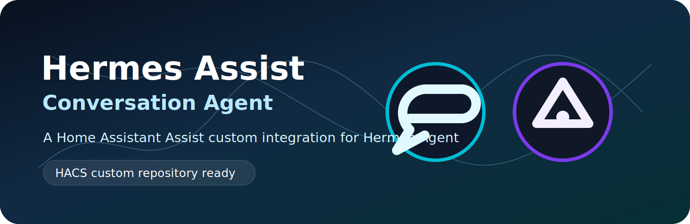
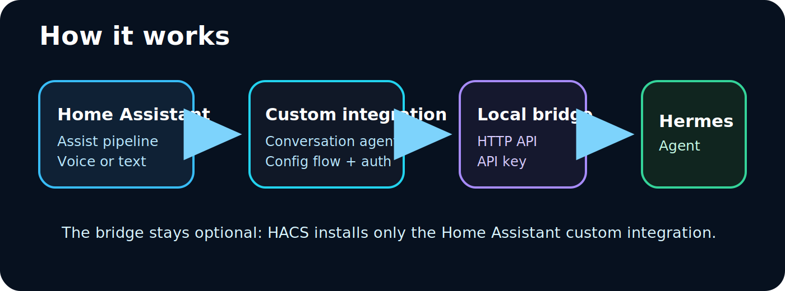

# Hermes Assist Conversation Agent

<p align="center">
  
</p>



Home Assistant custom conversation agent for routing Assist utterances to a local [Hermes Agent](https://github.com/NousResearch/hermes-agent) bridge.

## What this repository contains

- `custom_components/hermes_assist_conversation/` — the Home Assistant custom integration. This is the part HACS installs.
- `bridge/bridge.py` — an optional example HTTP bridge that forwards Home Assistant Assist requests to a locally installed Hermes Agent.

## Architecture



The integration and bridge communicate over HTTP:

- `GET /health` — bridge health check used during setup
- `POST /api/chat` — authenticated chat endpoint used by the conversation agent

## HACS installation

This repository must be **public** for HACS to use it.

1. In HACS, open **Custom repositories**.
2. Add this repository URL.
3. Select category **Integration**.
4. Install **Hermes Assist Conversation**.
5. Restart Home Assistant.
6. Go to **Settings → Devices & services → Add integration → Hermes Assist Conversation**.
7. Enter your bridge URL and API key.
8. Select `Hermes Assist` as the conversation agent in your Assist pipeline.

## Manual installation

Copy this directory into Home Assistant:

```text
custom_components/hermes_assist_conversation
```

Final Home Assistant paths should be:

```text
/config/custom_components/hermes_assist_conversation/manifest.json
/config/custom_components/hermes_assist_conversation/__init__.py
/config/custom_components/hermes_assist_conversation/config_flow.py
/config/custom_components/hermes_assist_conversation/conversation.py
/config/custom_components/hermes_assist_conversation/brand/icon.png
/config/custom_components/hermes_assist_conversation/brand/logo.png
```

Restart Home Assistant, then add the integration from Devices & services.

## Bridge setup

Run the bridge on the machine that has Hermes Agent installed. Generate a strong API key and store it in a local file:

```bash
python3 - <<'PY'
import secrets
print(secrets.token_urlsafe(48))
PY
```

Example:

```bash
export HERMES_ASSIST_KEY_FILE=/path/to/hermes-assist-bridge.key
export HERMES_ASSIST_PORT=8765
python3 bridge/bridge.py
```

For a persistent deployment, run the bridge under systemd or another service manager and store secrets outside the repository.

Supported bridge environment variables:

- `HERMES_ASSIST_HOST` — default `127.0.0.1`; set this explicitly if Home Assistant runs on another machine
- `HERMES_ASSIST_PORT` — default `8765`
- `HERMES_ASSIST_API_KEY` — API key if not using a key file
- `HERMES_ASSIST_KEY_FILE` — file containing the API key
- `HERMES_BIN` — Hermes executable, default `hermes`
- `HERMES_REPO` — optional Hermes source checkout for direct in-process mode
- `HERMES_ENV_FILE` — optional `.env` file to load into the bridge process
- `HERMES_ASSIST_MODEL`
- `HERMES_ASSIST_PROVIDER`
- `HERMES_ASSIST_TOOLSETS`
- `HERMES_ASSIST_MAX_TURNS`
- `HERMES_ASSIST_REASONING`
- `HERMES_ASSIST_USE_DIRECT_AGENT` — set to `1` to try in-process Hermes reuse

## Security notes

- Do not commit API keys, Home Assistant long-lived access tokens, Hermes credential files, `.env` files, or local service secrets.
- The bridge requires an Authorization header containing the configured bridge key for `/api/chat`.
- Keep the bridge reachable only by trusted systems or protect it behind your own network controls.
- Review the bridge's enabled Hermes toolsets before exposing it to voice input.

## Copyright and license

This project is licensed under the MIT License. See `LICENSE` and `NOTICE.md`.
